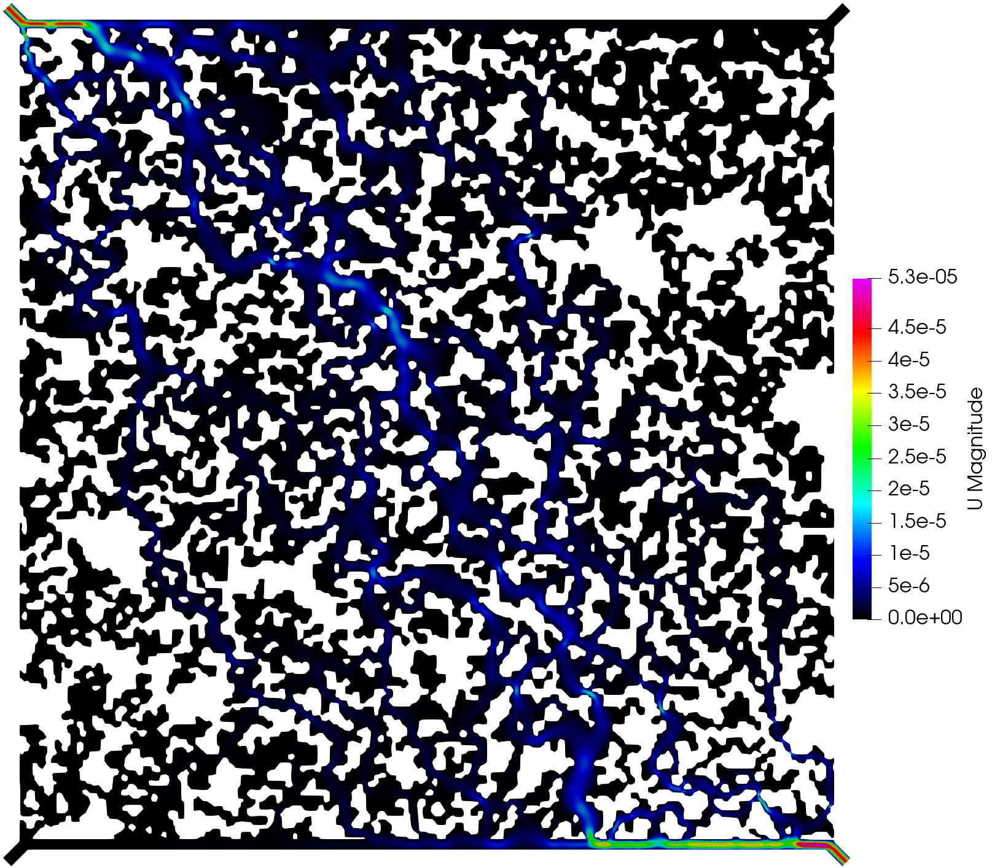

======
Online 
======

In this example we consider a micromodel available online in Fig. 2a in 
`Joekar-Niasar et al. 2009 <https://agupubs.onlinelibrary.wiley.com/doi/full/10.1029/2007WR006641>`_.

The image was extracted by screenshot and saved with the name 'online.png' (1068x1068 pixels).
The configuration file was saved as 'configuration.txt' and contained the following text:

.. code-block:: python
    :linenos:

    """Set the framework parameters"""
    600e-6      #Image-related, length of the microsystem [m]
    600e-6      #Image-related, height of the microsystem [m]
    1.8e-6      #Image-related, depth of the microsystem [m]
    160         #Image-related, threshold for converting the image to binary
    1.0         #Image-related, rescaled factor for the input image
    50          #Image-related, minimum size of the grain clusters
    1.0         #Image-related, tolerance to approximate the border as polygon
    1.0         #Image-related, tolerance to approximate the grains as polygon
    1.0         #Figure-related, line width to show the contours in the produced figures
    6e-6        #Device-related, width of the top and bottom channels in the micromodel device [m]
    1e-6        #Mesh-related, mesh size [m]
    1e-6        #Fluid-related, kinematic viscosity [Dynamic viscosity/fluid_density, m2/s]
    1e-12       #Tracer-related, diffusion coefficient [m2/s]
    2.0e-3      #Simulation-related, inlet boundary condition (Pressure/fluid_density, [Pa/(kg/m3)])
    120.0       #Simulation-related, end time for the tracer simulation [s]
    0.1         #Simulation-related, time interval to write the tracer results [s]
    1e-7        #Solver-related, convergence criterium for the pressure solution in the numerical scheme for the Stokes simulation
    1e-8        #Solver-related, convergence criterium for the velocity solution in the numerical scheme for the Stokes simulation
    10000       #Solver-related, maximum number of iterations for the Stokes simulation in case the convergence criteria have not been reached
    1.0         #Solver-related, time step in the numerical scheme for the Tracer simulation [s]

Here we used a version of Gmsh built from source, then we gave the path to the executable via the '-g' flag.
Since we are interested in the flow and tracer simulations, then we add the flag '-t all'.
Then, the following command was exectued in the terminal:

.. code-block:: bash

    pymm -i online.png -p configuration.txt -m device -t all -gmsh /home/AD.NORCERESEARCH.NO/dmar/Github/gmsh/build/gmsh

The execution time was ca. 15 minutes and the following are screenshots of the simulation results:

.. figure:: _static/online_pressure.png

.. figure:: _static/online_tracer.png

    Simulation results of the (top) pressure, (middle) velocity, and (bottom) tracer concentration.