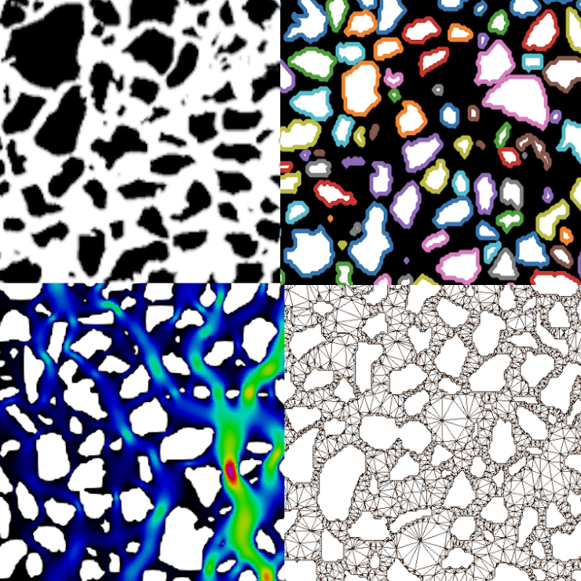

==========
About pymm
==========

The image-based Python package for computational fluid dynamics **pymm** is funded by 
Center for Sustainable Subsurface Resources [project no. 331841] and NORCE Norwegian 
Research Centre As [project number 101070]. 

Contributions are more than welcome using the fork and pull request approach.