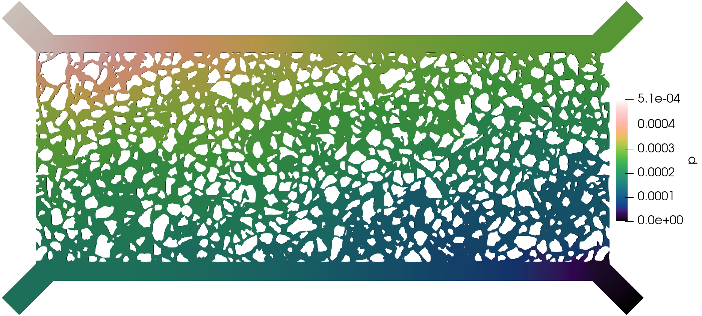
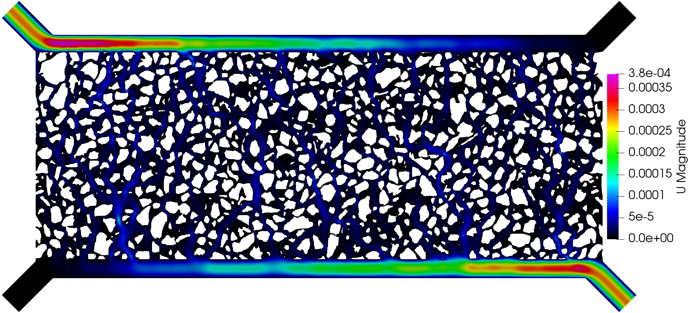
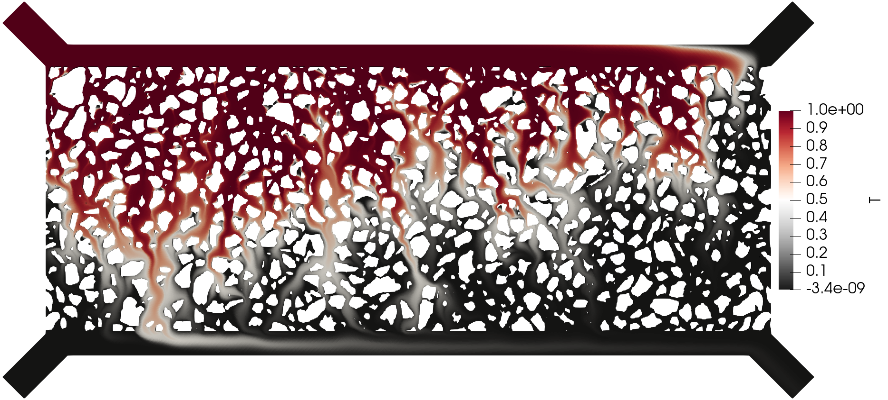

======
Device 
======

Here we consider the same image and configuration file as in the 
:doc:`Image example <./image>`, but we are interested now on the
device setup (the flow is from the top-left corner to the bottom-right
corner of the device). Then we add the corresponding flag to the **pymm**
executable:

.. code-block:: bash

    pymm -t all -m device

The execution time was ca. 35 minutes and the following are screenshots of the simulation results:

    Simulation results of the (top) pressure, (middle) velocity, and (bottom) tracer concentration.