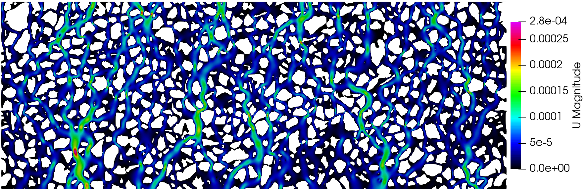

=====
Image 
=====

In this example we consider the micromodel described in the
:doc:`configuration file<./configuration_file>` section.

The image is available in the examples folder in the `Github page <https://github.com/cssr-tools/pymm>`_
with the default name 'microsystem.png'. The configuration file corresponds to the one in the 
:doc:`configuration file<./configuration_file>` section and it is saved as 'parameters.txt' 
(the default name for the configuration file). Since 'image' is the default entry for the simulation
setup (i.e., the flow is from top to bottom), and assuming that the command 'gmsh' in the terminal 
executes Gmsh, then to run the whole framework (meshing, flow, and tracer) it is enough to add the 
'-t all' command line to the pymm executable:

.. code-block:: bash

    pymm -t all

The execution time was ca. 20 minutes and the following are screenshots of the simulation results:

.. figure:: figs/velocity.png
.. figure:: figs/tracer.png

    Simulation results of the (top) pressure, (middle) velocity, and (bottom) tracer concentration.