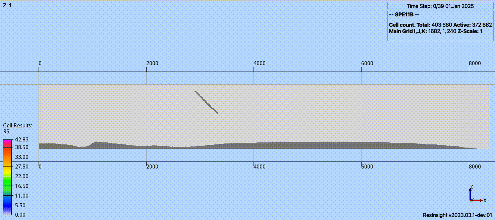
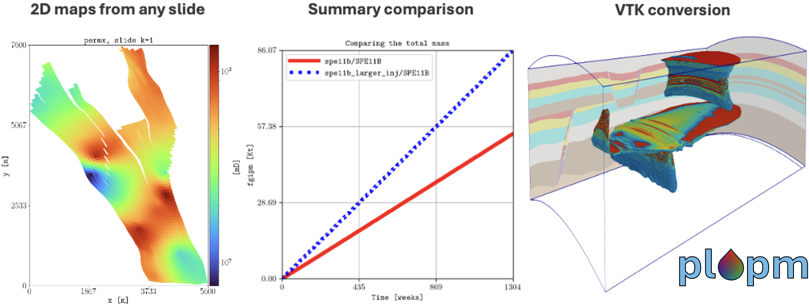
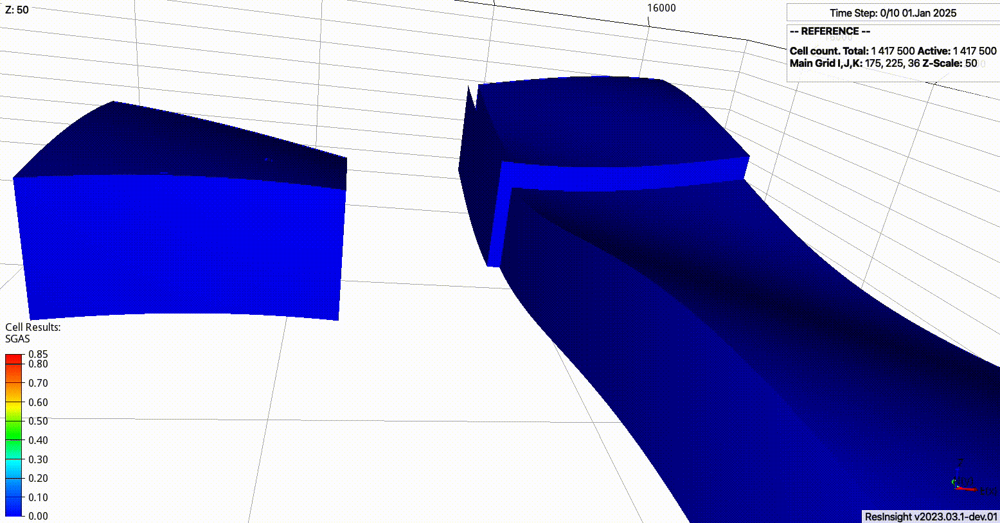
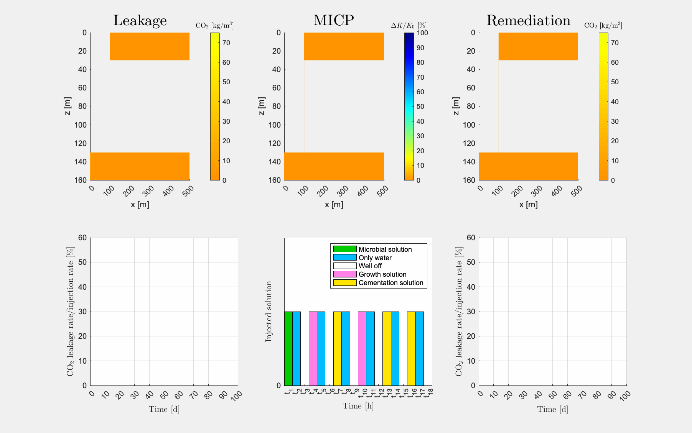

=======
Related
=======

Below are some tools that might be of interest; check them out 🙂.

**********
pyopmspe11
**********

`A Python framework using OPM Flow for the CSP SPE11 benchmark project <https://github.com/OPM/pyopmspe11>`_.

*************
pyopmnearwell
*************

.. image:: ./figs/pyopmnearwell.gif
    :scale: 50%

`A framework to simulate near well dynamics using OPM Flow <https://github.com/daavid00/pyopmnearwell>`_.

******
pycopm
******

.. image:: ./figs/pycopm.gif
    :scale: 60%

`Simplified and flexible framework for coarsening geological models <https://github.com/cssr-tools/pycopm>`_.

*****
plopm
*****

`Quick generation of PNG figures from a simulation model given any 2D slide <https://github.com/cssr-tools/plopm>`_.

********
expreccs
********

`Expansion of ResourCes for CO2 Storage on the Horda Platform <https://github.com/daavid00/expreccs>`_.

*******
ad-micp
*******

`A module to study CO2 leakage remediation by microbially induced calcite precipitation (MICP) <https://github.com/daavid00/ad-micp>`_.