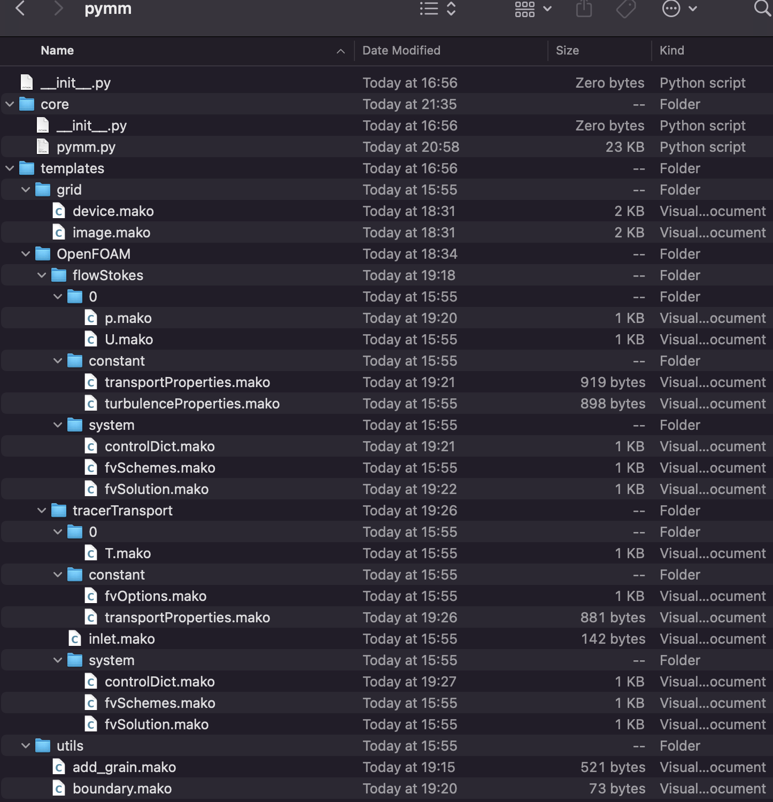

===============
pymm Python API
===============

The main script for the **pymm** executable is located in the core folder.
The templates folder contains mako files.

    Files in the pymm package.

.. include:: modules.rst